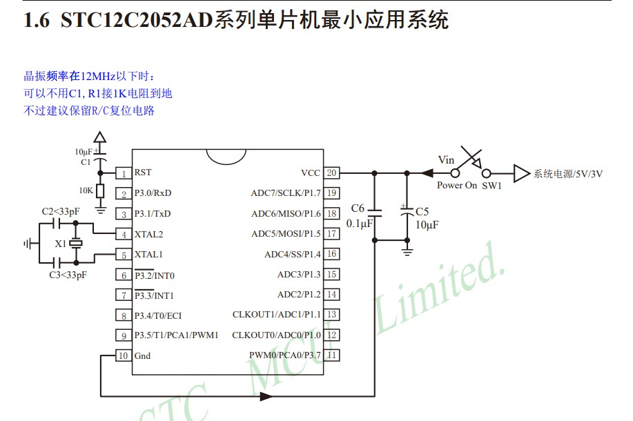

STC12C2052-Application
======================
### Notes
- Compilation
  - Keil C51 should be licensed because unlicensed C51 will produce huge `.hex` file and it cannot be programmed to the STC12C2052
- Programming
  - [dirkarnez/stc-isp](https://github.com/dirkarnez/stc-isp) v6.85I is recommended
  - "Arduino ISP" uses SPI to program STC mcu
    - Portable, no installation is needed
    - More pins
  - STC documentation demostrates using USART to program the mcu with a USB-To-TTL (e.g. CH340G)
    - lesser pins
    - Needs [STC ISP software](https://github.com/dirkarnez/stc-isp) which requires drivers installation
- Minimal circuit
  - **needs** external crystal (do not use internal because it has lower precision)
  - [搭建51单片机最小系统——以STC12C2052为例](https://zhou-yuxin.github.io/articles/2015/%E6%90%AD%E5%BB%BA51%E5%8D%95%E7%89%87%E6%9C%BA%E6%9C%80%E5%B0%8F%E7%B3%BB%E7%BB%9F%E2%80%94%E2%80%94%E4%BB%A5STC12C2052%E4%B8%BA%E4%BE%8B/index.html)
  - 

### ChatGPT
> To burn a program onto the STC12C2052 microcontroller using an Arduino
> UNO as a programmer, you can follow these steps:
> 
> 1. Set up the Arduino UNO as an ISP (In-System Programmer):
>    - Connect the Arduino UNO to your computer via USB.
>    - Open the Arduino IDE on your computer.
>    - Go to "File" -> "Examples" -> "11.ArduinoISP" and select the "ArduinoISP" sketch.
>    - Upload the sketch to the Arduino UNO.
> 
> 2. Connect the Arduino UNO to the STC12C2052:
>    - Disconnect the power supply from both the Arduino UNO and the STC12C2052.
>    - Connect the following pins between the Arduino UNO and the STC12C2052:
>      - Arduino UNO Pin 10 (SS) to STC12C2052 Pin 29 (P3.5)
>      - Arduino UNO Pin 11 (MOSI) to STC12C2052 Pin 30 (P3.6)
>      - Arduino UNO Pin 12 (MISO) to STC12C2052 Pin 31 (P3.7)
>      - Arduino UNO Pin 13 (SCK) to STC12C2052 Pin 28 (P3.4)
>      - Arduino UNO 5V to STC12C2052 VCC
>      - Arduino UNO GND to STC12C2052 GND
> 
> 3. Prepare the STC12C2052 for programming:
>    - Connect the power supply to the STC12C2052.
>    - Enable programming mode by connecting Pin 13 (P3.3) of the STC12C2052 to GND.
> 
> 4. Select the correct board and programmer in the Arduino IDE:
>    - In the Arduino IDE, go to "Tools" -> "Board" and select "Arduino UNO".
>    - Go to "Tools" -> "Programmer" and select "Arduino as ISP".
> 
> 5. Burn the program to the STC12C2052:
>    - Open the program you want to burn onto the STC12C2052 in the Arduino IDE.
>    - Go to "Sketch" -> "Upload Using Programmer" or press "Ctrl + Shift + U".
> 
> The Arduino IDE will compile the program and use the Arduino UNO as an
> ISP to burn the compiled code onto the STC12C2052 microcontroller.
> Once the process is complete, the program will be successfully burned
> onto the STC12C2052.
> 
> Remember to disconnect the programming connections and disable
> programming mode (remove the connection between Pin 13 and GND) before
> using the STC12C2052 for regular operation.

